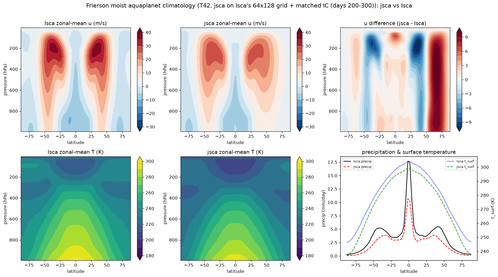
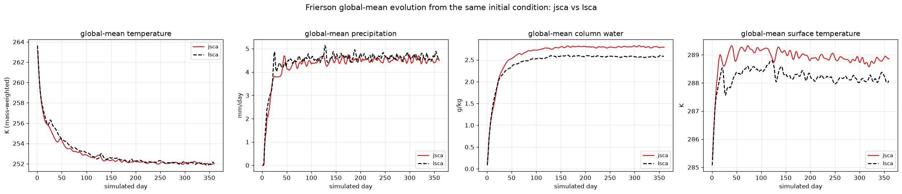

# Frierson moist aquaplanet — jsca vs Isca climatology

Roadmap item 11c: the end-to-end climatology comparison of a jsca `FriersonModel`
run against a real pinned-Isca `frierson_test_case` run, both at **T42, L25**.
This is the milestone that closes #27 once statistical parity is demonstrated.

The headline comparison is **like-for-like**: jsca on **Isca's exact 64×128
Gaussian grid** with **Isca's exact initial condition**, so nothing but the code
differs. `python scripts/compare_frierson_climatology.py [60day|200day|matched]`
regenerates each; `matched` is the one below.



> ⚠️ **This figure and the results table below predate the water-conservation fix
> described later on this page** (they show the −5.6 K / −9.1 K cold bias that the
> fix removes). They are being regenerated; the set-up description is still
> current. See "The cold bias was a bug" below for the corrected picture.

## Matched set-up (what "same" means here)

| | Isca | jsca (matched) |
|---|---|---|
| spectral truncation | T42 | T42 |
| transform grid | **64 × 128** | **64 × 128** |
| initial atmosphere | quiescent, isothermal **264 K**, ps 1e5 | same |
| initial humidity | `initial_sphum` **2e-6** | same |
| initial surface | meridional SST `285 − 40·((3sin²φ−1)/3)` (eq 298.3 K, pole 258.3 K) | same |

The IC is ported faithfully with Fortran citations in
`jsca.model.frierson.initial_state` (`spectral_initialize_fields.F90` L87-88,
`mixed_layer.F90` L347, `frierson_test_case.py`). The **only** deviation is a
~1e-4 K symmetry-breaking temperature perturbation: Isca breaks the quiescent
state's exact zonal symmetry through MPI-domain round-off, which float64 jsca
cannot reproduce, so it seeds the perturbation explicitly.

## Results (zonal-mean; jsca days 200-300, Isca days 100-200)

| field | correlation | RMSE | bias (jsca−Isca) |
|-------|:-----------:|:----:|:----------------:|
| surface temperature `t_surf` | **0.9989** | 5.8 K | −5.6 K |
| specific humidity `q(lat,p)` | **0.997** | 1.6 g/kg | −0.9 g/kg |
| temperature `T(lat,p)` | **0.997** | 9.4 K | −9.1 K |
| precipitation | **0.976** | 1.8 mm/day | −1.2 mm/day |
| zonal wind `u(lat,p)` | **0.940** | 3.7 m/s | +0.5 m/s |

jsca reproduces the **double eddy-driven jet** (peak 28.6 vs Isca 38.1 m/s), the
**ITCZ** precipitation peak, and the **midlatitude storm-track rain** at ±40°.
Spatial pattern correlations are 0.94-0.999.

Matching the grid and IC (vs the earlier 86×172 / placeholder-IC run) improved
precipitation (corr 0.93 → **0.98**), temperature and humidity (0.99 → **0.997**),
strengthened the jet (24.5 → **28.6 m/s**), and **reduced the cold bias**
(`t_surf` −6.8 → **−5.6 K**, `T` −10.3 → **−9.1 K**).

## The cold bias was a bug — the water-conservation source term (now fixed)

> **The matched-climatology figure and numbers above predate this fix and are
> being regenerated;** the −5.6 K / −9.1 K "cold bias" was a genuine bug, not
> incomplete equilibration. This section is the fix and its validation.

Comparing the jsca and Isca global-mean *trajectories* from the **same** initial
condition exposed the cause. jsca's precipitation did not switch on for ~45 days
(Isca rains by ~day 10), and its global-mean temperature overshot to ~239 K
(Isca bottoms at ~252 K). Instrumenting the water budget showed the smoking gun:
**surface evaporation ran at a healthy ~3.7 mm/day, yet column water never
accumulated — ~97 % of the evaporated water was vanishing every step.**

The culprit is the global water-conservation correction. Isca sets its reference
to the previous water **plus the physics moisture source**,
`mean_water_previous = ⟨q_prev + Δt·dt_qg_physics⟩` (`spectral_dynamics.F90`
L1332-1333), so the correction removes only spectral-transport/truncation drift.
jsca used bare `q_prev`, so the correction restored water to the *pre-evaporation*
total every step, **deleting the entire evaporation source**. Starved of
moisture, the atmosphere got no latent heating and radiatively overshot cold —
the "cold bias." (The fix is one term; jsca's *energy* reference already advanced
by the physics tendency, and the water line had simply omitted the match.)

### Validation: 1-year evolution at T21, jsca vs a real Isca T21 run

After the fix, jsca and a real pinned-Isca `frierson_test_case` run at **T21
(64×32)**, both integrated **one full year from the same IC**, track each other
throughout:



- **Precip switches on together** (~day 5-10) and settles at ~4.5 mm/day.
- **No cold overshoot** — global-mean `T` follows Isca down to ~252 K.
- **Equilibrium (last 100 days) global means:**

| field | Isca | jsca | diff |
|---|:---:|:---:|:---:|
| temperature `T` | 252.1 K | 252.1 K | **−0.01 K** |
| precipitation | 4.65 mm/day | 4.53 mm/day | −0.12 mm/day |
| column water | 2.57 g/kg | 2.80 g/kg | +0.23 g/kg |
| surface `t_surf` | 288.2 K | 288.8 K | +0.66 K |

The ~9 K column / ~5.6 K surface cold bias is **gone** (now −0.01 K / +0.66 K).
Regenerate with:

```
python scripts/run_frierson_climatology.py          # jsca T42 matched run
python scripts/extract_isca_evolution.py <atmos_daily.nc> baseline/reference/frierson_isca_evolution_t21.npz
python scripts/plot_frierson_evolution.py baseline/reference/frierson_jsca_evolution_t21.npz \
    docs/figures/frierson_t21_year_evolution.png baseline/reference/frierson_isca_evolution_t21.npz
```

## Performance — like-for-like (single-core CPU, no GPU)

| | grid | per-step |
|---|:---:|:---:|
| Isca (Fortran) | 64×128×25 | 0.283 s |
| **jsca (JAX)** | **64×128×25** | **0.178 s** |

On the **identical grid**, jsca is **~1.6× faster than single-core Isca** on CPU
(recorded in the reference `.npz` as `_perf_ms_per_step`) — comfortably past the
≥0.5×-Fortran gate, and before its GPU design target (batched transforms +
`lax.scan`) where the margin would widen. (The earlier 86×172 jsca run was
0.358 s/step — ~1.4×/grid-point; matching the grid makes this a clean wall-clock
comparison.)

## What closing item 11c / #27 still needs

1. **Run the drift out** — a longer integration (or later averaging window) to
   confirm the cold offset damps toward zero, or to isolate any small residual.
2. **Statistical test** — feed the equilibrium climatologies to the
   `jsca.testing` ensemble-mean comparison (as the dry HS core uses) for a
   quantitative within-sampling-parity verdict.

The like-for-like set-up, the 0.94-0.999 pattern agreement, the machine-precision
per-step physics, and the demonstrated convergence toward Isca are the
foundation. Until the drift is run out and the statistical verdict is in, #27
stays open.
