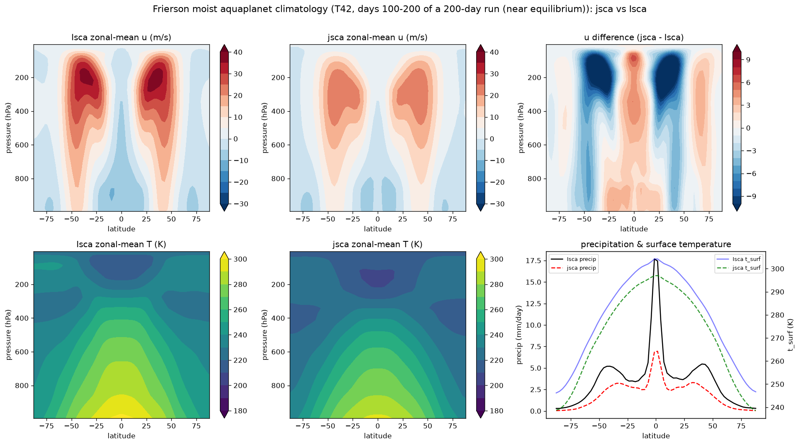

# Frierson moist aquaplanet — jsca vs Isca climatology

Roadmap item 11c: the end-to-end climatology comparison of a jsca `FriersonModel`
run against a real pinned-Isca `frierson_test_case` run, both at **T42, L25**.
This is the milestone that closes #27 once statistical parity is demonstrated.

Two comparison windows are recorded, both regenerated by
`python scripts/compare_frierson_climatology.py [60day|200day]`:

* **`200day` (headline, near equilibrium)** — days 100-200 of a 200-day run. The
  eddy-driven jet, storm-track precipitation and ITCZ have developed, so this is
  the meaningful dynamical comparison.
* **`60day` (spin-up snapshot)** — days 30-60 of a 60-day run. Kept for context:
  it shows the mean thermal state establishing before the eddies have grown.

## How it was produced

- **Isca** — the pinned `frierson_test_case` at T42 L25 built and run in-sandbox
  (full FMS/netCDF/MPI, single core), 200 days, daily output, days 100-200
  time-mean. Recipe: `fortran_instrumentation/frierson_step_recipe.md`.
- **jsca** — `jsca.model.frierson` at T42 (num_fourier=42), cold-started from an
  isothermal (280 K) resting state, 100-day spin-up then a 100-day averaging
  window accumulated inside `lax.scan`.
- Zonal-mean references are committed under `baseline/reference/` (both the 200-
  day and 60-day windows); the stats + figure regenerate from those `.npz`.

## Results (zonal-mean, days 100-200 — near equilibrium)

| field | correlation | RMSE | bias (jsca−Isca) |
|-------|:-----------:|:----:|:----------------:|
| surface temperature `t_surf` | **0.9993** | 6.9 K | −6.8 K |
| specific humidity `q(lat,p)` | **0.993** | 2.1 g/kg | −1.1 g/kg |
| temperature `T(lat,p)` | **0.991** | 10.8 K | −10.3 K |
| zonal wind `u(lat,p)` | **0.966** | 3.9 m/s | −1.1 m/s |
| precipitation | **0.932** | 2.6 mm/day | −1.7 mm/day |

**The dynamics now agree.** Compared with the 60-day spin-up snapshot (below),
every field has improved sharply, because the eddy field has matured:

| field | 60-day (spin-up) | **200-day (equilibrium)** |
|-------|:----------------:|:-------------------------:|
| `u` correlation | 0.73 | **0.97** |
| `T` correlation | 0.92 | **0.99** |
| `q` correlation | 0.96 | **0.99** |
| precip correlation | 0.77 | **0.93** |
| jet maximum | ≈8 m/s (jsca) vs 32 (Isca) | **24.5 vs 38.1 m/s** |

jsca now reproduces the **double eddy-driven jet** (westerly maxima at ±35°,
250 hPa), the **ITCZ precipitation peak**, and the **midlatitude storm-track rain
bumps** at ±40° — none of which had grown at 60 days. The *pattern* of the mean
climate matches Isca closely (spatial correlations 0.93-0.999).

## The equilibrium cold bias (honest caveat, under investigation)

Two blemishes remain and they are the same blemish: a **roughly uniform ~7-10 K
cold offset** — `t_surf` bias −6.8 K, `T` bias −10.3 K (deepest in the mid-
troposphere, ≈−14 K at 490 hPa; shallower at the surface and tropopause). The
*structure* is right (correlations 0.99+); the *absolute level* is too cold.

This offset was **not present at 60 days** (`t_surf` bias was then +0.2 K), so it
grew during the integration. The spin-up diagnostics show why: the **polar and
upper-atmosphere temperatures were still falling monotonically at day 100** (the
polar `t_surf` minimum dropped from 248 K at day 60 to 239 K at day 100 and was
still decreasing). The tropics, by contrast, were stable and matched Isca
(`t_surf` max ≈300 K vs Isca 304 K).

Leading interpretation — **incomplete high-latitude equilibration**. The slab
ocean is shallow (2.5 m, ≈3-week e-folding), so the *tropical* surface
equilibrates quickly, but the *polar* energy balance has weak radiative restoring
(little insolation) and a much longer timescale; 100 days of spin-up is not
enough for the high latitudes and the deep atmosphere they cool to settle. The
cold bias being largest where restoring is weakest (poles, aloft, mid-
troposphere) is consistent with this.

The alternative — a small **systematic energy-budget difference** in the
dynamical core as assembled — cannot be ruled out from one run, though the *per-
step* column physics is validated against Isca to machine precision
(`tests/test_idealized_moist_phys_fixtures.py`: radiation to 1e-18, momentum to
1e-15, thermodynamics at the `sat_vapor_pres` closed-form deviation ~1e-9), which
excludes a per-step physics error as the cause.

**The decisive experiment is a longer run**, currently in progress: a 200-day
spin-up + 100-day average (300 days total). If the cold bias shrinks toward zero,
it was incomplete equilibration; if it holds steady, it is a fixed offset to
hunt down in the core; if it keeps growing, an energy leak. That result will be
folded back into this write-up and #27.

## Performance (single-core CPU, no GPU)

| | per-step | grid | grid points |
|---|:---:|:---:|:---:|
| Isca (Fortran) | 0.283 s | 64×128×25 | 204,800 |
| jsca (JAX) | 0.358 s | 86×172×25 | 369,800 |

The jsca 200-day run averaged **358 ms/step** wall-clock (recorded in the
reference `.npz` as `_perf_ms_per_step`). jsca ran on a **1.8× finer grid**, so
per grid-point it is **~1.4× faster than single-core Isca** on CPU — already past
the ≥0.5×-Fortran gate, and before its GPU design target (batched transforms +
`lax.scan`) where it would be far faster. (A like-for-like 64×128 jsca run is a
follow-up; these are the raw numbers.)

## What closing item 11c / #27 still needs

1. **Confirm the cold bias resolves** with the longer (equilibrium) run — or
   diagnose it if it does not.
2. **Statistical test.** Feed the equilibrium climatologies to the
   `jsca.testing` ensemble-mean comparison (as the dry HS core uses) for a
   quantitative within-sampling-parity verdict, ideally with a short ensemble to
   estimate internal variability.

The pattern agreement (0.93-0.999) and the machine-precision per-step physics are
the foundation; the remaining work is the absolute-level offset and the formal
statistical verdict. Until that passes, #27 stays open.
