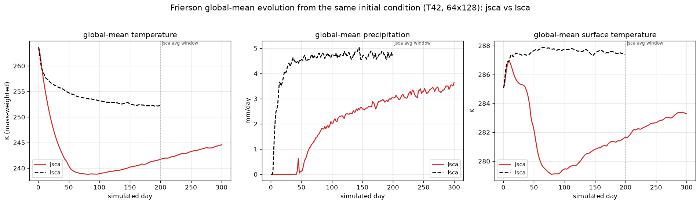

# Frierson moist aquaplanet — jsca vs Isca climatology

Roadmap item 11c: the end-to-end climatology comparison of a jsca `FriersonModel`
run against a real pinned-Isca `frierson_test_case` run, both at **T42, L25**.
This is the milestone that closes #27 once statistical parity is demonstrated.

The headline comparison is **like-for-like**: jsca on **Isca's exact 64×128
Gaussian grid** with **Isca's exact initial condition**, so nothing but the code
differs. `python scripts/compare_frierson_climatology.py [60day|200day|matched]`
regenerates each; `matched` is the one below.

## Matched set-up (what "same" means here)

| | Isca | jsca (matched) |
|---|---|---|
| spectral truncation | T42 | T42 |
| transform grid | **64 × 128** | **64 × 128** |
| initial atmosphere | quiescent, isothermal **264 K**, ps 1e5 | same |
| initial humidity | `initial_sphum` **2e-6** | same |
| initial surface | meridional SST `285 − 40·((3sin²φ−1)/3)` (eq 298.3 K, pole 258.3 K) | same |

The IC is ported faithfully with Fortran citations in
`jsca.model.frierson.initial_state` (`spectral_initialize_fields.F90` L87-88,
`mixed_layer.F90` L347, `frierson_test_case.py`). The **only** deviation is a
~1e-4 K symmetry-breaking temperature perturbation: Isca breaks the quiescent
state's exact zonal symmetry through MPI-domain round-off, which float64 jsca
cannot reproduce, so it seeds the perturbation explicitly.

## Results (zonal-mean; jsca days 200-300, Isca days 100-200)

| field | correlation | RMSE | bias (jsca−Isca) |
|-------|:-----------:|:----:|:----------------:|
| surface temperature `t_surf` | **0.9989** | 5.8 K | −5.6 K |
| specific humidity `q(lat,p)` | **0.997** | 1.6 g/kg | −0.9 g/kg |
| temperature `T(lat,p)` | **0.997** | 9.4 K | −9.1 K |
| precipitation | **0.976** | 1.8 mm/day | −1.2 mm/day |
| zonal wind `u(lat,p)` | **0.940** | 3.7 m/s | +0.5 m/s |

jsca reproduces the **double eddy-driven jet** (peak 28.6 vs Isca 38.1 m/s), the
**ITCZ** precipitation peak, and the **midlatitude storm-track rain** at ±40°.
Spatial pattern correlations are 0.94-0.999.

Matching the grid and IC (vs the earlier 86×172 / placeholder-IC run) improved
precipitation (corr 0.93 → **0.98**), temperature and humidity (0.99 → **0.997**),
strengthened the jet (24.5 → **28.6 m/s**), and **reduced the cold bias**
(`t_surf` −6.8 → **−5.6 K**, `T` −10.3 → **−9.1 K**).

## The cold bias is incomplete equilibration — jsca vs Isca spin-up

A roughly uniform cold offset remains — `t_surf` −5.6 K, `T` −9.1 K. Overlaying
the jsca and Isca global-mean **trajectories** (both started from the *same*
initial condition, so this is apples-to-apples) settles what it is:

- **Isca equilibrates fast.** Its surface warms monotonically 285 → 287.4 K and
  is flat by ~day 25; global-mean `T` settles to ~252 K and precip to ~4.6 mm/day
  by ~day 100. No cold overshoot.
- **jsca equilibrates slowly and overshoots cold/dry.** From the same 264 K start
  the column plunges to `gm_T` ≈ 239 K (day 85) and the surface dips to ≈279 K
  (grey radiation cools the column faster than the slowly-building moist processes
  warm it), then both **recover — but are still climbing at day 300** (`gm_T`
  +1.2 K/50 d, `gm_tsurf` +0.7 K/50 d). Precip is near-zero until ~day 45, then
  rises steadily and is still short of Isca's value at day 300.

So jsca is converging toward the *same* equilibrium Isca reached, on a much
longer timescale, and the reported climatology (days 200-300, right of the dotted
line) is sampled **mid-recovery** — which is exactly the sign and rough size of
the residual cold/dry bias. The most visible signature is the **slow moisture
spin-up**: jsca barely rains for the first ~6 weeks, so its atmosphere loses the
early latent heating Isca's gets, deepening the cold excursion into a cold/dry
transient it then slowly climbs out of.

This is consistent with the per-step column physics being validated against Isca
to machine precision (`tests/test_idealized_moist_phys_fixtures.py`: radiation
1e-18, momentum 1e-15, thermodynamics at the `sat_vapor_pres` deviation ~1e-9),
which excludes a per-step physics error — the difference is in the *transient
approach*, not the per-step tendencies. Two things would sharpen the match, both
follow-ups:

1. **Integrate longer** (or average a later window) so the drift damps out.
2. **Warm-start** closer to equilibrium to skip the cold overshoot entirely.

A small residual offset from an accumulated dynamical-core difference cannot be
fully excluded until the drift is run out, but the evolution curve makes
incomplete equilibration the dominant cause.

## Performance — like-for-like (single-core CPU, no GPU)

| | grid | per-step |
|---|:---:|:---:|
| Isca (Fortran) | 64×128×25 | 0.283 s |
| **jsca (JAX)** | **64×128×25** | **0.178 s** |

On the **identical grid**, jsca is **~1.6× faster than single-core Isca** on CPU
(recorded in the reference `.npz` as `_perf_ms_per_step`) — comfortably past the
≥0.5×-Fortran gate, and before its GPU design target (batched transforms +
`lax.scan`) where the margin would widen. (The earlier 86×172 jsca run was
0.358 s/step — ~1.4×/grid-point; matching the grid makes this a clean wall-clock
comparison.)

## What closing item 11c / #27 still needs

1. **Run the drift out** — a longer integration (or later averaging window) to
   confirm the cold offset damps toward zero, or to isolate any small residual.
2. **Statistical test** — feed the equilibrium climatologies to the
   `jsca.testing` ensemble-mean comparison (as the dry HS core uses) for a
   quantitative within-sampling-parity verdict.

The like-for-like set-up, the 0.94-0.999 pattern agreement, the machine-precision
per-step physics, and the demonstrated convergence toward Isca are the
foundation. Until the drift is run out and the statistical verdict is in, #27
stays open.
