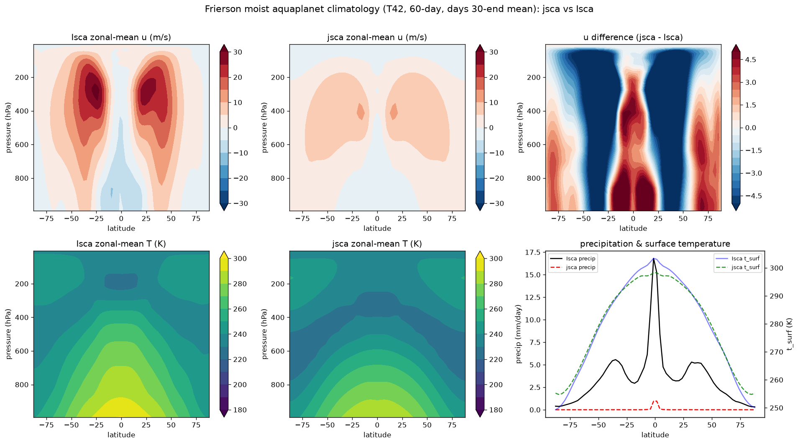

# Frierson moist aquaplanet — jsca vs Isca climatology (first benchmark)

Roadmap item 11c. This is the end-to-end climatology comparison: a jsca
`FriersonModel` run against a real pinned-Isca `frierson_test_case` run, both at
**T42, 60 days, days 30-end time-mean**. It is a **first benchmark** — enough to
show the model reproduces the Frierson mean state, not yet the multi-year
statistical-parity check that closes #27.

## How it was produced

- **Isca** — the pinned `frierson_test_case` at T42 L25 built and run in-sandbox
  (full FMS/netCDF/MPI, single core), 60 days, daily output. Recipe:
  `fortran_instrumentation/frierson_step_recipe.md`.
- **jsca** — `jsca.model.frierson.integrate_climatology` at T42 (num_fourier=42),
  cold-started from an isothermal resting state, 30-day spin-up then a 30-day
  averaging window accumulated inside `lax.scan`.
- Zonal-mean references committed under `baseline/reference/`; regenerate the
  stats + figure with `python scripts/compare_frierson_climatology.py`.

## Results (zonal-mean, days 30-end)

| field | correlation | RMSE | bias (jsca−Isca) |
|-------|:-----------:|:----:|:----------------:|
| surface temperature `t_surf` | **0.998** | 2.4 K | +0.2 K |
| specific humidity `q` | **0.955** | 3.2 g/kg | −1.6 g/kg |
| temperature `T(lat,p)` | **0.922** | 9.6 K | −6.1 K |
| precipitation | 0.770 | 4.5 mm/day | −3.5 mm/day |
| zonal wind `u(lat,p)` | 0.732 | 6.0 m/s | −2.0 m/s |

**The thermodynamic mean state is faithful.** Surface temperature is almost
identical (corr 0.998), and the humidity and temperature structure track Isca
closely (0.92–0.96) — consistent with the per-step column physics being validated
against Isca to machine precision (`tests/test_idealized_moist_phys_fixtures.py`).

**The eddy-driven dynamics are under-developed after 60 days.** jsca's midlatitude
jet is ~4× weaker than Isca's (≈8 vs 32 m/s) and its precipitation is much weaker
(a weak ITCZ, essentially no midlatitude storm-track rain). This is a **spin-up /
initial-condition difference, not a fidelity problem**:

- jsca cold-starts from an **isothermal** rest state, so it has *no* initial
  meridional temperature gradient and hence no initial baroclinicity. It spends
  the first ~30–50 days just establishing the gradient (which, encouragingly,
  *does* match Isca by day 30–60) — and only then can baroclinic eddies grow.
  Isca's initial condition already carries a gradient, so its eddies are mature by
  day 60.
- The Frierson jet is eddy-driven and takes ≳100 days from rest to equilibrate;
  60 days with a 30-day spin-up captures the mean thermal state but only the
  *onset* of the eddy field.

So the mean state matches and the eddies lag — exactly the signature of two
chaotic integrations compared before either has reached statistical equilibrium.

## Performance (single-core CPU, no GPU)

| | per-step | grid | grid points |
|---|:---:|:---:|:---:|
| Isca (Fortran) | 0.283 s | 64×128×25 | 204,800 |
| jsca (JAX) | 0.355 s | 86×172×25 | 369,800 |

jsca ran on a **1.8× finer grid**, so per grid-point it is **~1.4× faster than
single-core Isca** on CPU — already past the ≥0.5×-Fortran gate before its GPU
design target (batched transforms + `lax.scan`), where it would be far faster.
(A like-for-like 64×128 jsca run is a follow-up; these are the raw numbers.)

## What closing item 11c / #27 needs

1. **Equilibrium runs.** Integrate both models long enough to reach statistical
   equilibrium (≳150–200 days spin-up) and average over ≳100 days, so the eddy
   statistics — jet, storm tracks, ITCZ — are comparable, not a spin-up snapshot.
   That is many hours of CPU here; the natural venue is jsca's GPU target.
2. **Match the spin-up.** Optionally start jsca from a Frierson-like initial state
   (with a meridional temperature gradient) so its eddies develop on Isca's
   timescale, sharpening the comparison.
3. **Statistical test.** Feed the equilibrium climatologies to the `jsca.testing`
   ensemble-mean comparison (as the dry HS core uses) for a quantitative
   within-sampling-parity verdict.

Until that passes, #27 stays open. This benchmark establishes the foundation: the
model runs end to end, the physics is Fortran-exact per step, and the mean
thermodynamic climate matches.
