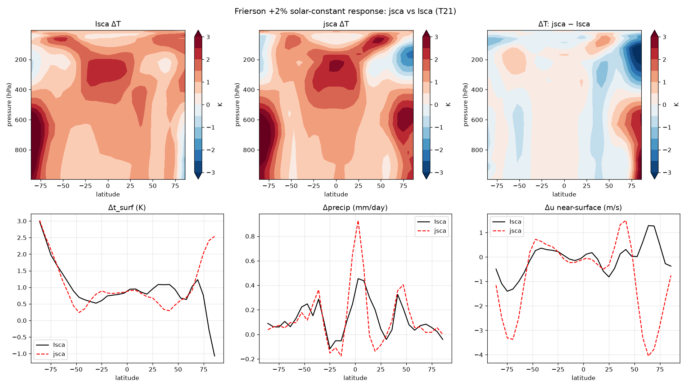

# Frierson +2% solar-constant response — does climate change look the same in jsca and Isca?

A climate-*change* test, complementing the mean-state parity (#27): raise the
solar constant by **2 %** (1360 → 1387.2 W/m²) in both jsca and Isca, run each to
equilibrium at **T21**, and compare the **response** (perturbed − control). This
probes whether jsca reproduces Isca's *sensitivity*, not just its climate.

Control and perturbed climatologies are 8 monthly (30-day) members each, from the
equilibrated window; member spread gives the ±1σ on the global-mean response.
`python scripts/compare_frierson_solar_response.py`.

## The response is similar

**Global-mean response (robust — noise averages out):**

| | Isca | jsca |
|---|:---:|:---:|
| surface warming Δt_surf | +0.88 ± 0.04 K | +0.81 ± 0.04 K |
| precipitation ΔP | +0.144 ± 0.011 mm/day | +0.161 ± 0.011 mm/day |
| hydrological sensitivity | +3.5 %/K | +4.3 %/K |

The global-mean warming agrees within ~0.08 K (error bars overlap), and both give a
positive hydrological sensitivity of a few %/K — jsca's is slightly higher.

**Structure — the classic signatures match:**

- **Temperature:** both warm most in the **tropical upper troposphere**
  (~200-300 hPa) — moist-adiabatic amplification — with surface warming toward the
  poles. jsca's tropical amplification is a touch stronger.
- **Precipitation** (pattern corr **0.78**): both show the **wet-get-wetter**
  signature — a tropical/ITCZ increase, a subtropical decrease, and a
  storm-track increase near ±40°. jsca's ITCZ response is sharper.
- **Surface warming by latitude:** the Δt_surf curves track closely from −75° to
  +60°.

## Honest caveat — the response is a small, under-sampled signal

The response (~0.8 K) is small next to the month-to-month internal variability, and
with only **8 members** the per-point response is noisy. That is why the *pattern*
correlations are modest (t_surf 0.26, u 0.35) even though the global mean and the
broad structure agree: the differences concentrate in the **polar caps** (most
visibly the NH pole in Δt_surf and Δu), exactly where internal variability is
largest and the signal smallest. Precipitation, with a larger signal-to-noise,
correlates best (0.78). Longer runs / more members would beat the polar noise down
and sharpen the pattern comparison; the global-mean response and the qualitative
structure are the trustworthy results here.

## Verdict

At the level 8 members can resolve, **jsca's climate-change response looks like
Isca's**: comparable global-mean warming and precip increase, the same positive
hydrological sensitivity, tropical upper-tropospheric amplification, and a
wet-get-wetter / storm-track precipitation response. The unresolved piece is the
polar pattern, which is noise-limited at this ensemble size rather than clearly
divergent.
