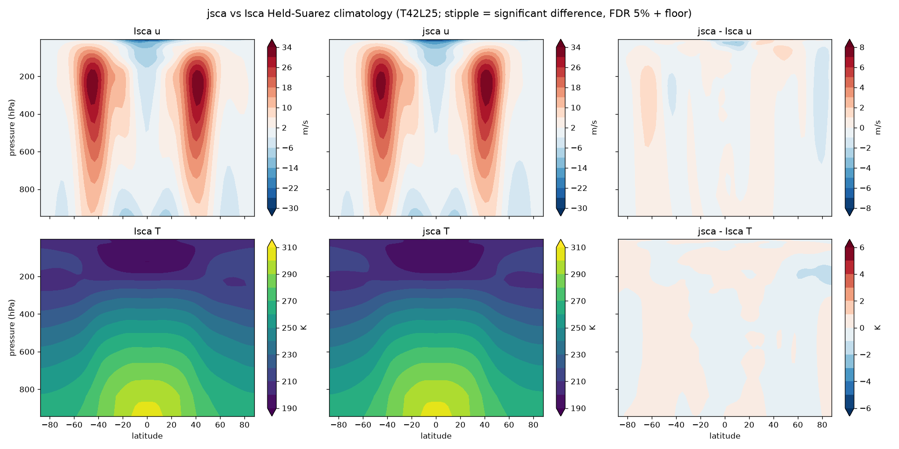

# Held-Suarez validation: jsca vs Isca at the native config

The dry Held-Suarez benchmark is the first end-to-end fidelity gate for the port.
This records jsca statistically reproducing the pinned Isca climatology at the
**native benchmark configuration** — T42, 25 uneven-sigma levels,
`damping_order=4`, **`dt=600 s`** — the exact config Isca ships, now that the
triangular-truncation fix makes jsca stable there.

## Setup

Both models: integrate the dry HS94 forcing from a resting isothermal state,
discard the first 120 days as spin-up, and form eight 30-day monthly means as an
ensemble.

- **Isca** (`baseline/reference/hs_isca_members.npz`): the real Fortran, pinned
  commit `a290bc3`, months 5-12 of a 12-month run (`baseline/PINNED.md`).
- **jsca** (`baseline/reference/hs_jsca_members_dt600.npz`): the JAX port at the
  matched config, 120-day spin-up + 240-day sampling
  (`bench/run_jsca_held_suarez.py --dt 600`). The zonal-mean fields sit on Isca's
  own Gaussian grid and level pressures (identical to machine precision).

## Test

`jsca.testing.ensemble_mean_test` (Tier-3): at each (level, latitude) point, is
jsca's ensemble-mean within Isca's own month-to-month spread? Two-sided, FDR-
controlled at 5% across all points, with a practical-significance floor (2 m/s
for u, 1.5 K for T) so meaningless sub-noise differences are never flagged.

## Result — pass

| field | bias | RMS | max &#124;diff&#124; | points failing equivalence |
|---|---|---|---|---|
| zonal wind u | −0.09 m/s | 0.69 m/s | 3.1 m/s | **0.0 %** |
| temperature T | −0.02 K | 0.31 K | 1.4 K | **0.0 %** |

- Eddy-driven jet strength: **Isca 33.6 m/s, jsca 33.7 m/s** (±40°, 250 hPa).
- **No** (level, latitude) point differs from Isca beyond its internal
  variability — `fail_fraction = 0.0 %` for both u and T.
- The difference fields (see figure) are pale everywhere, with no significance
  stippling.

Reproduce: `bench/run_jsca_held_suarez.py --dt 600` then
`baseline/compare_hs.py --jsca <run>.npz`.

`hs_jsca_members_dt600.npz` is jsca output (not a Fortran fixture) — kept here as
the record of this validation, not as golden data.
