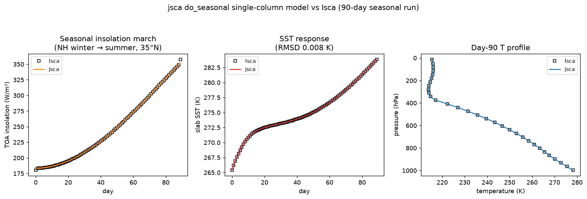

# The single-column model (SCM) port

This documents the jsca port of Isca's single-column model (`src/atmos_column`),
implemented in `jsca/model/column.py`. It is the Tier-2 physics-chain test harness
called for in the scoping doc (§4.4): the full column physics stepped over many
timesteps **with the dynamical core bypassed**, so a jsca-vs-Isca comparison
isolates the physics from spectral-dynamics chaos. Cite McKim et al. (2024) for the
Isca SCM.

## What the SCM is

Isca's `column_mod` is a **drop-in replacement for `spectral_dynamics`** in the solo
driver (`atmosphere.F90`, selected by the `-DCOLUMN_MODEL` compile flag). The
per-step physics — convection → large-scale condensation → grey radiation → surface
fluxes → boundary-layer diffusion → slab ocean — is identical to the full model
(`idealized_moist_phys`, already ported and assembled in
`jsca/model/idealized_moist_phys.py`). What the column replaces is everything
*dynamical*:

| | Full model (`frierson.py`) | Single column (`column.py`) |
|---|---|---|
| horizontal transport | spectral advection | none |
| semi-implicit gravity-wave solve | yes | none |
| spectral damping / sponge | yes | none |
| mass / energy / water global corrections | yes | none |
| winds `u, v` | prognostic | **prescribed, fixed** |
| surface pressure `ps` | prognostic (continuity) | **fixed** |
| temperature `T` | spectral + physics | **grid leapfrog of physics `dt_tg`** |
| humidity `q` | tracer advection + physics | **grid leapfrog of physics `dt_qg`** |
| slab SST `t_surf` | mixed layer (in physics) | mixed layer (in physics) |

So one SCM step is: run the physics on the previous time level, then leapfrog **only
T and q** forward with the physics tendencies. The momentum tendency from the
boundary-layer diffusion is *computed and discarded* — the SCM's stated assumption
is that "the dynamics" would restore the prescribed surface wind, so the net
d(u)/dt = 0 (`column.F90` returns `ug/vg` from the unchanged previous slot,
L358-360). Surface pressure never changes, so `p_half`/`p_full` are constant in time.

## Faithfulness (CLAUDE.md rules 1-2)

* **Leapfrog.** The SCM's `leapfrog_3d_real` (`column.F90` L756-799) is arithmetically
  identical, line by line, to the already-ported `jsca.dycore.leapfrog.leapfrog`
  (the combined Robert–Asselin–Williams form). Note the SCM's *real* variant **does**
  apply `raw_filter_coeff` on the current-level update, unlike the dycore's
  `leapfrog_2level_A_3d_real` quirk — so `leapfrog` (not the `_real` split) is the
  faithful match. The SCM defaults `robert_coeff = 0`, `raw_filter_coeff = 1`
  (`column_nml`): with no dynamics there is no gravity-wave noise for the filter to
  control.

* **`q_decrease_only`.** The optional stratospheric humidity clamp (`column.F90`
  L782-792) sweeps levels upward, capping each at the level below it. With the level
  axis last (k = 0 top … K-1 surface) applied per column, that is exactly a reverse
  cumulative minimum, implemented in `jsca.dycore.leapfrog.apply_q_decrease_only`.
  *Documented deviation:* the Fortran takes its clamp **decision** from the first
  column `q(1,1,k)` but assigns to all columns — only self-consistent for a genuine
  single column. jsca applies the clamp independently per column (identical for the
  single-column case the SCM is built for; more sensible for multi-column runs).

* **Initial condition.** `initial_state` ports `column_initialize_fields.F90`
  L74-79: `u = v = surface_wind/√2` at the bottom level (zero aloft), uniform T,
  `ps = exp(ln p_ref − Φ_s/(R_d T₀))`, uniform `sphum`. The slab starts uniform at
  `tconst` (`prescribe_initial_dist = False`).

* **Geopotential time level.** The physics sees geopotential heights computed from
  the **current**-level temperature, matching `atmosphere.F90`'s column flow (it
  recomputes `z_full/z_half(current)` from `tg` at the end of each step and hands
  those to the next physics call). Pressures use the fixed `ps`.

Every physics kernel is golden-fixture-validated against Isca to machine precision;
the SCM is their *assembly*, gated (like the `frierson.py` assembly) by a
stability/invariant smoke test (`tests/test_column.py`). A machine-precision golden
column-step fixture needs a full Isca build; the driver stub for the new
initial-condition arithmetic is
`fortran_instrumentation/dump_column_init_reference.F90` (fixtures pending).

## Resolved: the vertical coordinate (was a flagged ambiguity)

The canonical Isca column namelist
(`exp/test_cases/column_test_case/column_test.py`) sets **both**
`column_nml:num_levels = 31` (with the default `vert_coord_option = 'even_sigma'`)
**and** an explicit 25-level `vert_coordinate_nml`. Because `even_sigma` never reads
that namelist, the 26-entry `pk`/`bk` would be silently ignored.

**Confirmed by a real Isca column run** (2026-08; output archived at
`baseline/reference/column_scm_isca_daily_t264.nc`): Isca runs **31 even-sigma
levels** (`bk = [0, 1/31, …, 1]`) and ignores the 25-level table, exactly as
hypothesised. `build_column()` therefore still defaults to the 25-level Frierson
coordinate (the levels the physics kernels were fixture-validated on), and
`scripts/compare_column_scm.py` reads Isca's actual `pk`/`bk` from the reference
file so the comparison is on Isca's real 31 even-sigma levels. To reproduce Isca's
default column grid directly, pass
`vert_coord_option='even_sigma', num_levels=31, pk=None, bk=None`.

A second thing the run pinned down: with `prescribe_initial_dist = False` and no
restart, Isca's `mixed_layer` seeds the slab SST from the **lowest model-level
temperature** (= `initial_temperature`, 264 K), not `tconst` (285 K).
`initial_state` now defaults `t_surf` to `initial_temperature` to match.

## Validation against Isca (Tier-2)

A 40-day single-column spin-up, jsca vs a real Isca run on Isca's own 31 even-sigma
levels, same latitude / timestep / cold-start IC and the canonical `column_test.py`
physics (`scripts/compare_column_scm.py`, figure
`docs/figures/column_scm_vs_isca.png`):

Against the canonical `column_test.py` reference:

| diagnostic | agreement |
|---|---|
| day-40 SST | jsca 288.014 vs Isca 288.021 K (Δ 0.007 K) |
| day-40 precip | jsca 3.137 vs Isca 3.142 mm/day (Δ 0.005) |
| day-40 T profile | RMSD 0.13 K |
| day-40 q profile | RMSD 0.11 g/kg |
| SST trajectory (40 d) | RMSD 0.012 K |

The SST trajectory tracks Isca to hundredths of a kelvin. The biggest single fix was
reproducing **Isca's deliberately unstable slab initialisation** — `t_surf =
init_temp + 1 K` (`idealized_moist_phys.F90` L643, "to allow moisture to quickly
enter the atmosphere avoiding problems with the convection scheme"): without it the
SST trajectory is offset ~1 K early, decaying to ~0.3 K by day 40; with it the SST
RMSD drops from **0.55 K to 0.02 K** (diagnosis: Isca's per-step `delta_t_surf`
matched jsca's to 1e-4 from step 1 — only the *initial* SST differed). Note
`constant_gust` really is negligible here (Frierson sets it 0); `do_lcl_diffusivity_depth`
was *not* — an early on/off test made it look so, but the golden step fixture later
showed it was the dominant **profile** residual (below).

jsca now runs the **full canonical column config**, and the golden step fixture drove
the last differences to ground. In order of size:

1. **`t_surf = init_temp + 1 K`** (above) — SST 0.55 K → 0.02 K.
2. **`do_lcl_diffusivity_depth=True`** — the boundary-layer depth is the **convective
   LCL height**, not the bulk-Richardson PBL. This was the dominant remaining residual.
3. **`surface_flux use_virtual_temp=True`** (`d608*q` virtual-T stability) and
   **`lscale_cond do_evap=False`** — golden-fixture-validated (`use_virtual_temp` to
   1e-6, `tests/test_surface_flux_fixtures.py`); smaller contributors.

**How the golden step fixture localised it.** Instrumenting the running Isca column
(dump each stage's I/O at a real step, feed jsca the identical inputs) ruled suspects
in and out cleanly:

* **Convection is exact** — fed Isca's true instantaneous column, jsca's
  `qe_moist_convection` reproduces the rain to **+0.00%**, the same `klzb`/`convflag`,
  and the tendencies to the `sat_vapor_pres` es floor
  (`tests/test_column_convection_step_fixtures.py`). The ~6% a mean-state convection
  call over-rains is a nonlinearity artefact of the daily-mean profile, not a bug.
* **The full physics step** matched Isca everywhere **except the boundary-layer top
  (levels 26-28)**, and — the smoking gun — **`pbl_height` differed by 6.5 m.** jsca's
  Richardson PBL vs Isca's LCL PBL: jsca's LCL height (948.030 m) equals Isca's
  `z_pbl` (948.030 m) to 4 decimals, confirming `do_lcl_diffusivity_depth` as the
  cause. Porting it (`qe_moist_convection` now returns the LCL index;
  `diffusivity(ind_lcl=...)` sets `h` to the LCL height) made `pbl_height` match
  exactly.

**Result.** Against the canonical reference, day-40 agreement is now SST RMSD
**0.012 K**, T-profile **0.13 K**, q **0.11 g/kg**, precip **0.005 mm/day**; across the
latitude sweep every column agrees to SST ≤ 0.018 K, T ≤ 0.027 K, q ≤ 0.026 g/kg,
precip ≤ 0.007 mm/day — the moist tropics tightened ~15× in the profiles and ~100× in
precip.

### CI regression gate

`tests/test_column_vs_isca.py` (single column) and `tests/test_column_sweep_vs_isca.py`
(five latitudes) run this comparison on every commit and assert jsca stays within
tolerance of the Isca trajectory — after the `t_surf` fix, SST RMSD < 0.1 K
(measured 0.02), and the profile tolerances (T-profile RMSD < 0.3 K, q < 0.3 g/kg;
< 0.5 K / 0.6 g/kg across the sweep to cover the moist tropics) sized to the
`use_virtual_temp` gap — so a physics regression fails CI rather than being
discovered later. **CI never needs Isca itself**: it validates against committed
golden trajectories
(`baseline/reference/column_scm_isca_t264.npz`, `…_sweep.npz`; numpy-only, distilled
from the raw Isca NetCDF), the same posture as the frierson climatology references.
The remaining tropical-profile tolerance headroom is the per-step residual above;
the golden step fixture (#43) is the checkpoint for tightening it further.

### Reproducing / regenerating the Isca reference

Everything needed to rebuild the Isca side is committed, so the reference can be
regenerated whenever the physics config or the pinned Isca changes:

```bash
bash scripts/build_isca_column.sh                 # toolchain + pinned Isca + patch
python scripts/run_isca_column_reference.py 40    # run Isca -> atmos_daily.nc
cp <run>/atmos_daily.nc baseline/reference/column_scm_isca_daily_t264.nc
python scripts/distill_column_reference.py        # NetCDF -> committed .npz
python scripts/compare_column_scm.py <atmos_daily.nc>   # refresh the figure
```

This keeps the "reproduce Isca if we want to" path live while CI itself stays
Isca-free.

## Physics options (validated in the SCM)

The SCM is the fast validation bench for swappable physics. Each option is opt-in
(default = the Frierson config, so the runs above are unchanged) and validated
against Isca here before it runs in the full 3D model.

* **`rad_scheme`** (grey radiation longwave): `"frierson"` (default) or `"byrne"`
  (Byrne & O'Gorman 2013, humidity + CO2 dependent LW). Golden-fixture-validated to
  machine precision (`tests/test_two_stream_gray_rad_byrne_fixtures.py`).

* **`do_seasonal`** (seasonal + diurnal insolation): switches the shortwave from
  the default perpetual-equinox annual-mean profile to the astronomically computed
  cycle (`jsca.physics.astronomy.diurnal_solar` — orbital angle, declination,
  Earth-Sun distance, half-day). `build_column(do_seasonal=True, solday=…,
  equinox_day=…, year_in_s=…)` precomputes the orbital table and threads the model
  clock through the step; `solday >= 0` freezes the season (perpetual day-of-year
  with a diurnal cycle). The astronomy is fixture-validated to 1e-12
  (`tests/test_astronomy_fixtures.py`).

  **Validation against Isca** (`tests/test_column_seasonal_vs_isca.py`; reference
  `scripts/run_isca_column_seasonal.py` with `do_seasonal=.true.`, `thirty_day`
  calendar, `current_date=[1,1,1]`, lat 35.3 deg N, 90 days from NH winter). Over
  the run the daily-mean TOA insolation climbs ~180 → ~358 W/m² and the slab SST
  warms ~265 → ~284 K. jsca reproduces this:

  | diagnostic | agreement |
  |---|---|
  | TOA insolation (interior days) | ~machine precision |
  | TOA insolation (90-day RMSD) | 0.7 W/m² (2 run-boundary days only, averaging-window convention) |
  | SST trajectory | RMSD 0.008 K (max 0.016 K) |
  | precip trajectory | max Δ 0.042 mm/day |
  | day-90 T / q profile | 0.07 K / 0.06 g/kg |

  

  The only non-trivial residual is a few W/m² on the two run-boundary days, purely
  from how the daily-mean output window lands on the timesteps at the very start and
  end of the run (Isca's final daily mean includes the last end-of-run step that
  jsca's per-day window omits) — a diagnostic convention, not a physics difference;
  the interior 88 days match to machine precision.

* **`convection_scheme`** (`idealized_moist_phys_nml`): `"SIMPLE_BETTS_MILLER"`
  (default, the qe scheme), `"FULL_BETTS_MILLER"` (the classic Betts–Miller 1986
  adjustment — its own `capecalcnew` parcel ascent with a hardcoded LCL table and
  no virtual-temperature effect, relaxing T/q to a reference profile with the
  `do_simp` energy-conserving timescale adjustment; golden-fixture-validated with
  klzb/klcl exact and CAPE/tendencies to the saturation-vapour tolerance,
  `tests/test_betts_miller_fixtures.py`), `"DRY"` (Schneider–Walker dry convective
  adjustment —
  relaxes T toward a prescribed lapse rate `gamma` over `tau`; touches only
  temperature and, like Isca, **skips large-scale condensation**;
  golden-fixture-validated to machine precision incl. CAPE/CIN and the surface-based
  *and* elevated-LCL cases, `tests/test_dry_convection_fixtures.py`), or `"NONE"`
  (F90 `NO_CONV`) — no convective adjustment at all; large-scale condensation still
  runs. NO_CONV pairs with the
  bulk-Richardson PBL (`do_lcl_diffusivity_depth=False`, since there is no
  convective LCL). It is validated by composition (every downstream module is
  golden-fixture-validated) rather than a tight trajectory test: with convection off
  the near-surface is only marginally stratified (dry static energy uniform to
  ~0.1 K across the PBL), so the boundary-layer *depth* — a threshold crossing — is
  genuinely ill-conditioned, and a ~1e-6 difference in the surface-flux `u_star`/
  `b_star` moves the PBL top by tens of metres and amplifies over a 40-day
  integration. Fed *identical* surface fluxes the diffusivity is exact, so this is a
  property of the NO_CONV configuration, not a port error
  (`tests/test_column_noconv.py`). `FULL_BETTS_MILLER` / `RAS` / `DRY` are not yet
  ported.

### Diffusivity `do_simple=.false.` (Isca's default) — a fidelity fix

Isca's `diffusivity_nml` default is **`do_simple=.false.`**, which the column and
Frierson runs use (neither sets `diffusivity_nml`). jsca originally implemented only
the `do_simple=.true.` path; the gap was invisible until NO_CONV because every
earlier column validation used `do_lcl_diffusivity_depth=True`, which takes the PBL
top from the convective LCL and **bypasses `pbl_depth` (and `svcp`) entirely**. The
`do_simple=.false.` path is now ported (`jsca/physics/diffusivity.py`): the
dry-static-energy `svcp` carries the virtual-temperature correction `T·(1+d608·q)`,
and unstable columns (`b_star>0`) place the PBL top with a parcel-buoyancy crossing
instead of the Richardson one. It is golden-fixture-validated against the unmodified
Fortran across stable **and** unstable columns to machine precision (PBL depth
exact; `tests/test_diffusivity_nosimple_fixtures.py`). `DiffusivityParams.do_simple`
now defaults to `False` to match Isca. The `do_lcl=True` SCM validations above are
unchanged (they never touch this code); the Frierson 3D climatology now uses Isca's
actual diffusivity config and should be re-confirmed at T21 (a fidelity improvement,
not a regression).

## Usage

```python
from jsca.model import column as C

m  = C.build_column()                 # 1 column, Frierson 25-level, global-avg lat
s0 = C.initial_state(m)               # cold start (T=264 K, q=1e-3, u_surf=5 m/s)
s, clim = C.integrate_climatology(m, s0, spinup_steps=..., avg_steps=..., cold_start=True)
# clim: time-mean 'temp','sphum' (nlat,nlon,K), 't_surf','precip' (nlat,nlon)
```

`build_column` also runs a small set of **independent** columns via `latitudes` /
`longitudes` (each responds to its own insolation; there is no horizontal coupling).

## Not ported

* `num_steps > 1` sub-stepping inside a single `column` call (Isca default is 1).
* Restart I/O, diagnostics manager, `graceful_shutdown`, JSON logging, the
  `hs_forcing` (dry) column path (the SCM is wired to the moist physics; the dry
  path is a small future addition), and the `global_average` insolation trick (the
  single-column test uses `lat_value = arcsin(1/√3)` instead — carried as
  `GLOBAL_AVERAGE_LAT_DEG`).
